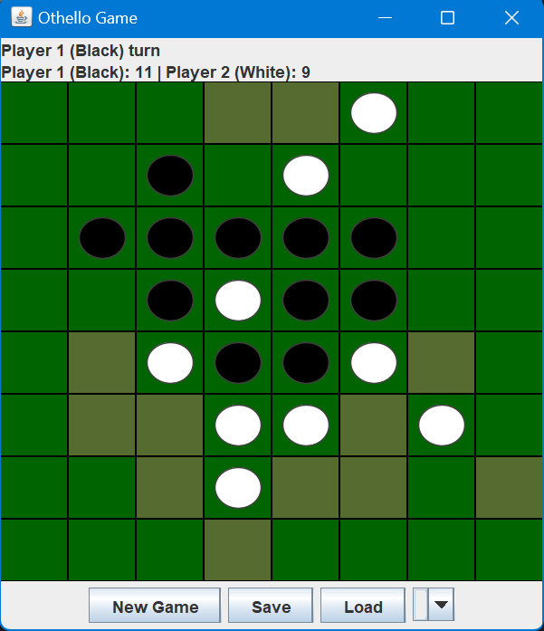

# 🟢 Othello Game (Java)

A simple implementation of the classic **Othello (Reversi)** board game built in **Java** using a graphical interface.

This project was developed as a learning exercise to practice:
- Object-Oriented Programming (OOP)
- Event handling
- GUI development in Java
- Game logic implementation

---

## 📸 Screenshot

> Screenshot of the Othello game during gameplay.
---
## 🎮 Features

- Two-player local gameplay
- Interactive graphical board
- Valid move detection
- Automatic disc flipping
- Turn-based system following official Othello rules

---

## 🛠️ Technologies Used

- **Java**
- **Java Swing / AWT**
- **IntelliJ IDEA**

---

## 📁 Project Structure

OthelloGame  
├─ src  
│  ├─ OthelloApp.java  
│  └─ DiscButton.java  
├─ .gitignore  
└─ README.md  

---

## ▶️ How to Run

### IntelliJ IDEA (Recommended) or Java IDE
1. Open the project in **IntelliJ IDEA**
2. Make sure a JDK is configured
3. Run `OthelloApp.java`

